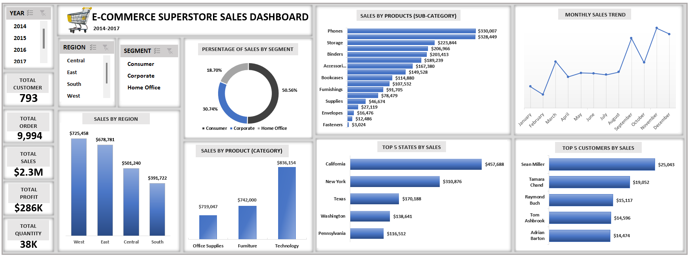

# SUPERSTORE-SALES-ANALYSIS
## PROJECT OVERVIEW
The aim of this project is to perform extensive data analysis to deliver insights into the sales performance of an E-commerce retail company, on how to increase its profits while minimizing the losses. The store is into sales of Furnitures, Office supplies and Technology.
## DATA SOURCE
Dataset used is from Kaggle and it’s a csv file. It contains 21 columns and 9995 (including the dataset header). File was duplicated and the working file opened and saved as an Excel File (.xlsx)
## BUSINESS TASK
Using Exploratory Data analysis to explore the dataset to answer key questions, such as;
- Analyze the important KPI’s
- What are the best performing products (category) by sales?
- What are the most/least ordered product (sub-category) by sales?
- Who are the top 5 customers?
- What are the top 5 states by sales? 
- Analyze the sales by region
- Analyze sales by segment
- What is the sales trend report (by month, quarter, year)?
- Identify the most valuable PRODUCT based on total profit. 
## DATA CLEANING
I performed the following data cleaning process; 
- No duplicate was found
- Data inspection: overall inspection of the data by using the ‘Filter’ tool
- Converted the Order_date, Ship_date to date format, Sales and Profit to currency and Discount to percentage data type respectively.
- Created new columns to get the month and year from the Order_date using formula **=Text(value,”formattext”)**
- Lastly, converted the data to a table
## DATA ANALYSIS/VISUALIZATION

## KPI's/OBSERVATIONS
These are the insights summarized as follows;
- The total number customer is 793
- The total number of products ordered is 9,994
- Total sales and profit generated is approximately $2.3 million and $286,000 respectively
- The region with the highest sales is the West, with a total order of 3,203 and sales of $725,458
- The best performing product by category is Technology with a total sale of $836,154.10, followed by Furniture the Office Supplies
- The best performing product (sub category) are Phones, with total sales of $330,007.10 and Fasteners has the least sales of $3,024.25
- Sean Miller is the customer with the highest sales in the year 2014, Peter Fuller in 2015, Tamara Chand in 2016 and Raymond Buch in 2017
- California is the leading state with a total sale of $457,687.68 from 2014-2017
- The Consumer segment has the highest percentage of sales of 50.56%, followed by Corporate with 30.74%, then Office with 18.70%
## RECOMMENDATIONS
Through effective data visualization and insightful analysis gathered, I will recommend these for the company.
1. Provide recommendations to optimize sales and increase profitability, which are as follows
- Create a good brand identity that accurately represents what the business is all about and resonates with your target audience, likewise brand visibility with the help of some social media platforms like facebook, Instagram that can drive sales through the use of paid adverts
-	Empowering sales team with important resources, trainings and motivation to engage customers and contribute to revenue growth
-	Marketing strategies should be implemented to focus on products and regions with low sales.
-	Products with little or no discounts should also be looked into. 
2. Suggest strategies to improve customer satisfaction and retention by doing these
- Aside from discounts, incentive like free shipping can also help customers make purchases across the regions
- Providing excellent customer service can help increase customer satisfaction and encourage repeat purchases. Making sure there are offers like live chat, phone and email support to help with complaints and enquiries
- Store policies can make or break sales, so the company should consider having a good implemented not too strict return or refund policies

